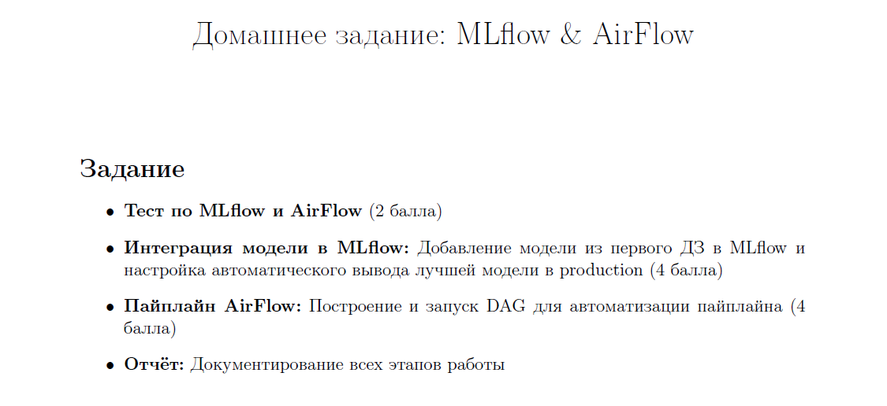
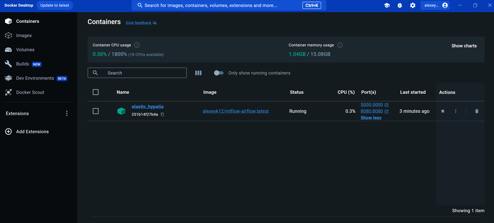
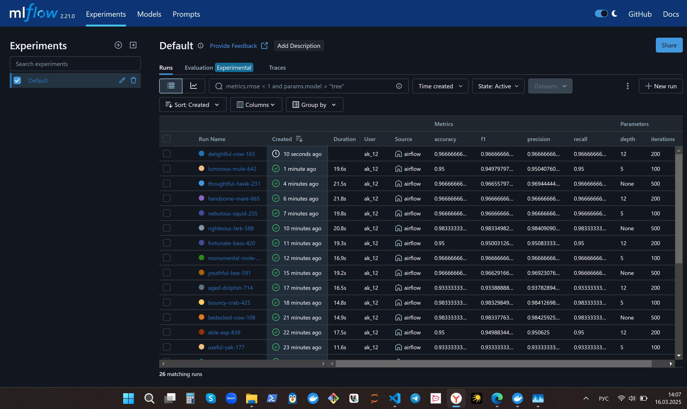
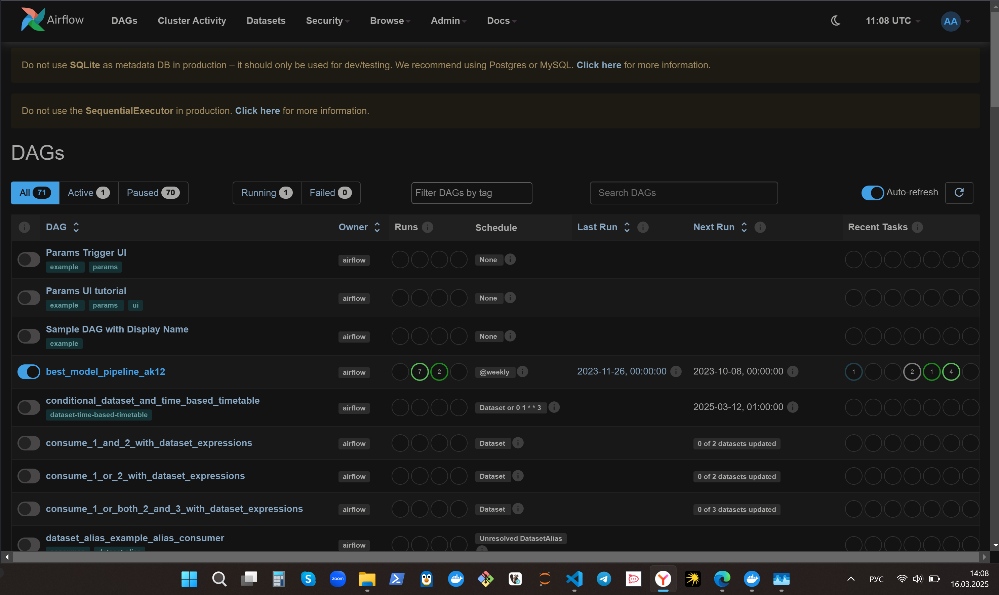
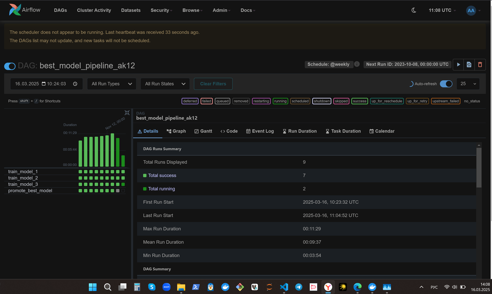
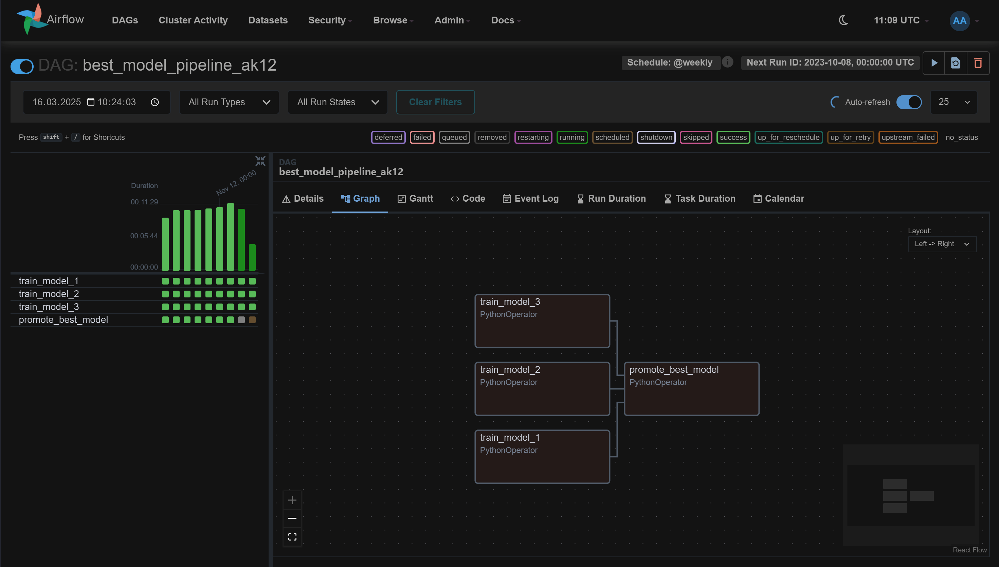
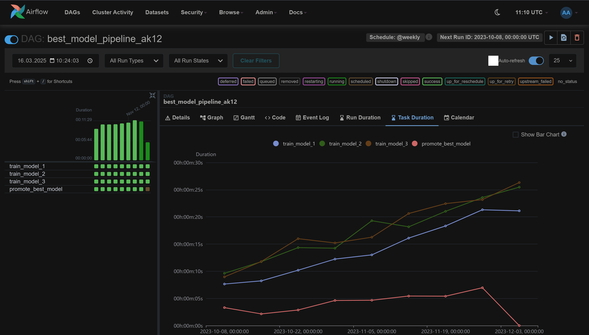
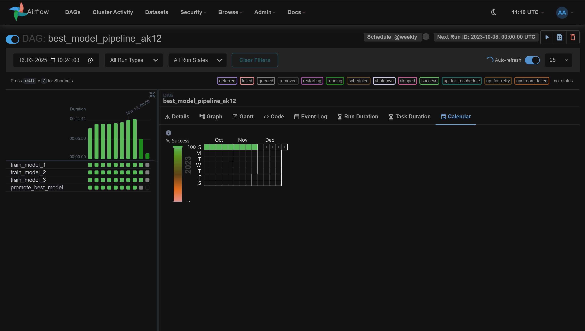

# ОТЧЁТ

## Получилось:
- Пайплайн AirFlow;
- Интеграция модели в MLflow;
- Развернуть AirFlow и MLflow через Docker и minicube;
- Развернуть AirFlow и MLflow локально с коректным запуском сценария;

## Неполучилось:
- Запуск скрипта из контейнера, т.к. ни через обычный контейнер, ни через minikube не видно дага(потратил более 15 часов, испробовано очень много фиксов, но результата нет)

## Проблемы:
- очень долго потбирал версии numpy для catboost. Из-за нестыковок даг не было видно и локально;
- часто приходится перезапускать AirFlow и контейнеры для корректной работы;
- слишком большое количество нюансов в версиях, ОС и тд 🤯🤯🤯

